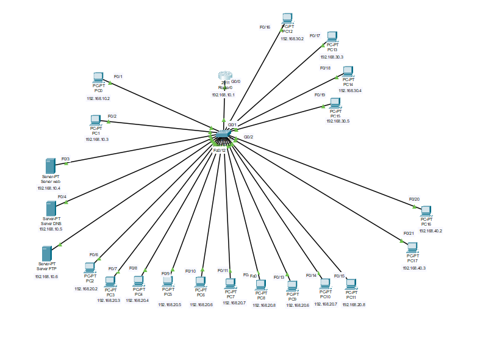

# Projet_Réseau

# **SAE12** : Mettre en oeuvre un réseau informatique <lr>
 
<!--OBJECTIVE-->

Objectif :
 
 Cette SAE est un projet qui a pour but de mettre en œuvre un réseau informatique, ce qui implique généralement
 
1. Installer et configurer un réseau local (LAN)
 
adressage IP 
plan d'adressage 
configuration de routeurs/switchs 
création de sous-réseaux 
 

2. Mettre en place des services réseaux de base, par exemple :
 
DHCP 
DNS 
serveur web 
 

3. Sécuriser et tester le réseau
 
contrôle d’accès 
tests de connectivité (ping, tracert…) 
diagnostics réseau 

4. Documenter et justifier les choix techniques
 
schéma réseau 
configuration expliquée 
 

<!--LISTE EQUIPEMENTS-->

## **
1. Equipement du réseau
**  
 

- **Routeur Cisco série 2911** :
 

**Rôle** : Il sert de passerelle par défaut (Gateway). Il gère le routage inter-VLAN (pour que l'Admin accède aux autres réseaux) et le service DHCP (pour distribuer les IP automatiquement).
 
 
- **Switch Cisco Catalyst 2960** :
 
**Rôle** : Il interconnecte tous les équipements. C'est lui qui crée la séparation entre les VLANs (ports d'accès) et qui communique avec le routeur via un lien Trunk. 

## **
2. Equipement d'interconnnexion
**   
 
- **cable Rj45** : Pour permettre l'interconnection des differents équipements
(Rj45 droit & Rj45 croisé) 
 

## **
3. Equipement de terminaison(Les hôtes)
**  
 

- **VLAN 10** : Admin
- Plage adresse ip : 192.168.10.2-253
- Serveur Web, DNS & FTP : Hébergeant le site intranet (Apache2), la résolution de noms (Bind9) ainsi qu'un service de transfert de fichiers (ProFTPD ou VSFTPD) pour le partage centralisé des ressources de l'entreprise. 
   - IP fixe serveur web : 192.168.10.4
   - IP fixe serveur dns : 192.168.10.5
   - IP fixe serveur FTP : 192.168.10.6
  
  * Apache2 (Le serveur Web)
        C'est le logiciel qui permet d'afficher ton site internet.

      **À quoi ça sert ?** Sans Apache, quand un employé tape l'adresse du site, il ne verrait rien. Apache "donne" les pages web (le texte, les images) aux navigateurs des PC du personnel.

 

  * Bind9 (Le serveur DNS)
        C'est l'annuaire du réseau.

      **À quoi ça sert ?** Les ordinateurs ne comprennent que les chiffres (ex: 192.168.10.10). Les humains préfèrent les noms (ex: www.entreprise.local).

      *Quelque commande pour aider à l'installation :
      Avant toute chose, il faut mettre à jour la liste des paquets et installer le service. 
            `sudo apt update` 
            `sudo apt install bind9 bind9utils bind9-doc`
            
  

- **VLAN 20** : Personnel
 Plage adresse ip : 192.168.20.2-253

- **VLAN 30** : Production 
 Plage adresse ip : 192.168.30.2-253

- **VLAN 40** : Vidéo
 Plage adresse ip : 192.168.40.2-253
- **Serveur NVR** : 
    - Pour le managment des caméras Ip
      Charger de l'enregistrement et le stokage des vidéos sur des disques pour le revisionnages 
      
    - Il centralise la surveillance et évite que les 24 flux ne saturent le reste du réseau.
  

# Dimensionnement pour le projet

Ce dimensionnement est une estimation fait par moi pour m'aider a avancer sur le projet 
- 2 PC Admin (VLAN 10)
- 10 PC Personnel (VLAN 20)
- 3 PC Production (VLAN 30)
- 2 PC Vidéo + 1 NVR + 24 Caméras (VLAN 40)
- 2 PC Wifi (vlan 50) pour SAE 2èm année
  

## **
4. Commande pour configuration 
**

# **Configuration Cisco**
 

### **
Configurationn du switch 
** 
## Création et Nommage des vlans

enable
configure terminal

### vlan 10
 name ADMIN
### vlan 20
 name PERSONNEL
### vlan 30
 name PRODUCTION
### vlan 40
 name VIDEO
 exit  

## Configuration du lien trunk 
* interface g0/1
 * switchport mode trunk
 * no shutdown
 exit 

## Création des VLANs

 **Admin**
* interface range f0/1 - 5
 * switchport mode access
 * switchport access vlan 10
 exit 

 **Personnel**
* interface range f0/6 - 15
 * switchport mode access
 * switchport access vlan 20
 exit 

 **Production**
* interface range f0/16 - 19
 * switchport mode access
 * switchport access vlan 30
 exit 

 **Vidéo**
* interface range f0/20 - 24
 * switchport mode access
 * switchport access vlan 40
 exit 
 
### **
Routeur
** 
### **
Configurationn des sous interfaces
** 

* enable
* configure terminal

### VLAN 10 - ADMIN
**interface g0/0.10**
 * encapsulation dot1Q 10
 * ip address 192.168.10.1 255.255.255.0
 * no shutdown
 * exit

### VLAN 20 - PERSONNEL
**interface g0/0.20**
 * encapsulation dot1Q 20
 * ip address 192.168.20.1 255.255.255.0
 * no shutdown
 * exit

### VLAN 30 - PRODUCTION
**interface g0/0.30**
 * encapsulation dot1Q 30
 * ip address 192.168.30.1 255.255.255.0
 * no shutdown
 * exit

### VLAN 40 - VIDEO
**interface g0/0.40**
 * encapsulation dot1Q 40
 * ip address 192.168.40.1 255.255.255.0
 * no shutdown
 * exit
  

**Activation de l'interface physique**   
**interface g0/0**
 * no shutdown
 * exit
  
## **Image**  

### **Image illustrative de la maquette**
 
 

### **Maquette sur cisco**
 
 

### **Diagramme de Gant**

 
 
 

<!--INSTALLATION DU SERVEUR APACHE-->
# **5. Configuration en physique** 
Port série : /dev/ttyS0 
Débits/Parité/Bits : 9600 8N1 
Contrôle de flux matériel : Non 
Contrôle de flux logiciel : Non 

## Configuration du switch et pour l'ACL, ce sont les même commande que Cisco packet tracer 

## **Configuration du SSH** 
Pour permettre un accès distant sécurisé au périphérique Cisco (switch/routeur) via SSH, au lieu de telnet (non chiffré). 

* enable 
* configure terminal 
* ip domain-name reseau.local 
* crypto key generate rsa 
* How many bits in the modulus [512]: 2048 
* username admin privilege 15 secret [motdepasseadmin] 
* line vty 0 4 
* transport input ssh 
* login local 
* exit 
* ip ssh version 2 
 
La connexion sur ce switch peut alors se faire via ssh admin@[@IP_de_l_equipement] 

## **Configuration du routeur**
conf t 
ip routing 

vlan 10 
name Admin 
vlan 20 
name Personnel 
vlan 30 
name Production 
vlan 40 
name Vidéo 
vlan 50 
name Wifi 

interface giga0
 switchport mode trunk 
 switchport trunk allowed vlan 10,20,30,40,50 
 no shutdown 

interface vlan 10 
 ip address 192.168.10.2 255.255.255.0 
 no shutdown 

interface vlan 20 
 ip address 192.168.20.2 255.255.255.0 
 no shutdown 

interface vlan 30 
 ip address 192.168.30.2 255.255.255.0 
 no shutdown 

interface vlan 40 
 ip address 192.168.40.2 255.255.255.0 
 no shutdown 

interface vlan 50 
 ip address 192.168.50.2 255.255.255.0 
 no shutdown 

### **Configurationn du serveur apache**

### **[Documentation utilisée pour l'installation du serveur appache](https://fr.linux-console.net/?p=14996)**

### **Installation de curl**

sudo apt install curl : j'ai dû installer cette commande car le pc ne l'avait reconnue  
